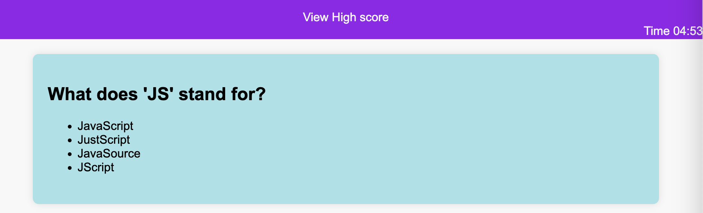
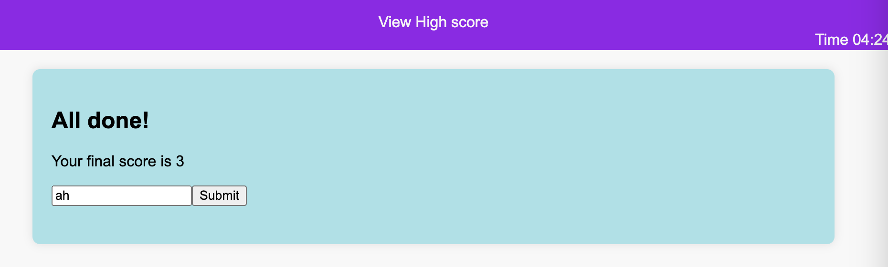

# Codequiz-Javascript-

## Description 
This is a quiz application built with HTML, CSS, and JavaScript. It uses JavaScript to present quiz questions, validate user responses, calculate scores, and display final results based on user input.

## User Story
AS A coding boot camp student,
I WANT to take a timed quiz on JavaScript fundamentals that stores high scores,
SO THAT I can gauge my progress compared to others.

## Screenshots
This shows the quiz format and questions

This shows the option to enter the information in the scoreboard

## Deployed Application

View below:
[Here]( )

